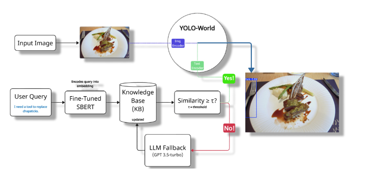

# Vague2Detect

Vague2Detect is a hybrid open-world object detection pipeline that interprets vague, functional prompts and grounds them into concrete visual detections.  
It combines:
- Sentence-BERT (SBERT) for semantic grounding  
- A structured Knowledge Base (KB) for commonsense memory  
- YOLO-World for open-vocabulary object detection  
- A GPT fallback module for handling unseen concepts  

This project was developed as part of research in Commonsense-Guided Open-World Detection at Dongguk University, Seoul.

---
## Architecture

<p align="center">
  
</p>


## Features
- Handles ambiguous prompts (e.g., "something to cut food with" → knife).  
- Dynamically expands the KB with GPT-generated entries.  
- Verifies predictions visually with YOLO-World.  
- Introduces a new evaluation metric: Vague Prompt Success Rate (VPSR).  
- Benchmarked on approximately 1000 household-object images.  

---

## Project Structure

```

Vague2Detect/
│── README.md
│── requirements.txt
│── .gitignore
│── LICENSE
│
├── assets/          # Knowledge Base JSON files
├── data/            # Sample/demo images
├── experiments/     # Fine-tuning SBERT, training scripts
├── src/             # Source code (pipeline, components, utils)
├── models/          # Pretrained weights (ignored in git)
├── results/         # Detection outputs & logs
└── docs/            # Figures for paper & documentation

````

---

## Installation

1. Clone the repository:
```bash
git clone https://github.com/ibrohimgets/Vague2Detect.git
cd Vague2Detect
````

2. Install dependencies:

```bash
pip install -r requirements.txt
```

3. Download YOLO-World weights:

```bash
mkdir models
# Place yolov8x-worldv2.pt inside models/
```

---

## Usage

Run detection with an image and a vague prompt:

```bash
python src/components/eval_pipeline.py \
  --image data/images/speaker.png \
  --prompt "something to listen to music with"
```

---

## Results

| Configuration               | VPSR (%) | Det.Acc (%) |
| --------------------------- | -------- | ----------- |
| YOLO-World baseline         | 32       | 29          |
| SBERT (fine-tuned) + YOLO-W | 61       | 61          |
| Full pipeline (with GPT)    | 85       | 83          |

---

## Citation

If you use this code in your research, please cite:

```bibtex
@inproceedings{muminov2025vague2detect,
  title={Vague2Detect: Handling Ambiguous Prompts in Knowledge-Based Open-World Detection},
  author={Muminov, Ibrohimjon and Kim, Jihie},
  booktitle={Proceedings of CSAI},
  year={2025}
}
```

---
