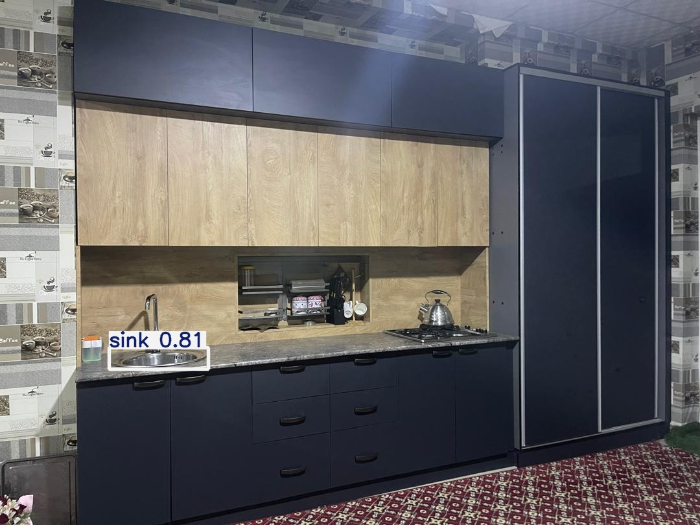
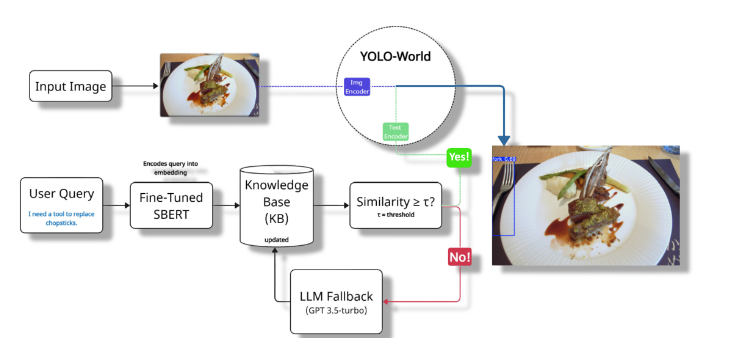

# Vague2Detect

Vague2Detect grounds functional, ambiguous language into concrete object
detections.

> "Something to cut food with" -> **knife** -> localized bounding box

The project combines semantic retrieval, a structured commonsense knowledge
base, YOLO-World, and an LLM fallback. It was developed at Dongguk University
and accepted at AIComPS 2025.

<p align="center">
  
</p>

## Client problem

Most detectors work best when users provide exact class labels. In search,
robotics, assistive systems, and inventory workflows, people more naturally
describe what an object should do. Vague2Detect converts that intent into a
searchable object class, detects it, and measures whether both the class and
box are correct.

## Architecture

<p align="center">
  
</p>

1. SBERT ranks knowledge-base entries against the request.
2. YOLO-World detects the selected open-vocabulary class.
3. An optional LLM fallback proposes new structured entries when the knowledge
   base does not cover the request.
4. Evaluation measures semantic class selection and detection at IoU >= 0.5.

## Reported research results

The original experiment used approximately 1,000 household-object images.

| Configuration | VPSR (%) | Detection accuracy (%) |
| --- | ---: | ---: |
| YOLO-World baseline | 32 | 29 |
| Fine-tuned SBERT + YOLO-World | 61 | 61 |
| Full pipeline with GPT fallback | 85 | 83 |

**VPSR** (Vague Prompt Success Rate) measures whether the system resolves the
functional request to the intended object class. Detection accuracy additionally
requires a correct localization at IoU >= 0.5.

These numbers are retained as reported research results. The public repository
does not yet include the complete evaluation dataset and trained SBERT artifact,
so they should not be treated as an independently reproducible benchmark.

## Repository layout

```text
Vague2Detect/
|- assets/                    # Structured knowledge bases
|- docs/                      # Architecture and example images
|- experiments/bert/          # SBERT training experiments
|- results/                   # Example output
|- src/components/            # Pipeline and evaluation scripts
`- requirements.txt
```

## Environment

```bash
git clone https://github.com/ibrohimgets/Vague2Detect.git
cd Vague2Detect
python -m venv .venv
source .venv/bin/activate  # Windows: .venv\Scripts\activate
pip install -r requirements.txt
```

If the GPT fallback is enabled, provide the key through the environment rather
than writing it into source code:

```bash
export OPENAI_API_KEY="your-key"  # PowerShell: $env:OPENAI_API_KEY="your-key"
```

## Reproduction status

The checked-in scripts preserve the research workflow, but several currently
contain machine-specific absolute paths for datasets, weights, and the
fine-tuned SBERT model. Update those constants for your environment before
running them. The public sample is therefore best treated as an inspectable
research prototype, not a one-command package.

## Limitations

- Results depend on the quality and coverage of the knowledge base.
- The LLM fallback can return invalid or overly broad concepts and must be
  validated.
- A semantic match does not guarantee that YOLO-World can localize the object.
- The current repository has no automated tests or hosted demo.

## Roadmap

- Move paths and thresholds into a versioned configuration file.
- Publish a small evaluation subset and exact metric script.
- Add tests and a deterministic demo command.
- Add success and failure galleries plus a short demo video.
- Package the stable path as an API after evaluation is reproducible.

## Citation

```bibtex
@inproceedings{muminov2025vague2detect,
  title     = {Vague2Detect: Handling Ambiguous Prompts in Knowledge-Based Open-World Detection},
  author    = {Muminov, Ibrohimjon and Kim, Jihie},
  booktitle = {Proceedings of AIComPS},
  year      = {2025}
}
```

## Security

Never commit API keys, private datasets, or model weights. Use environment
variables and review generated knowledge-base entries before saving them.
